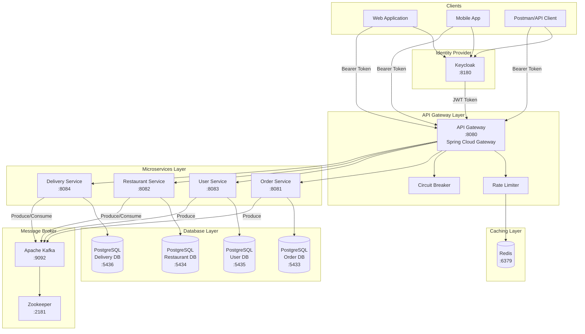
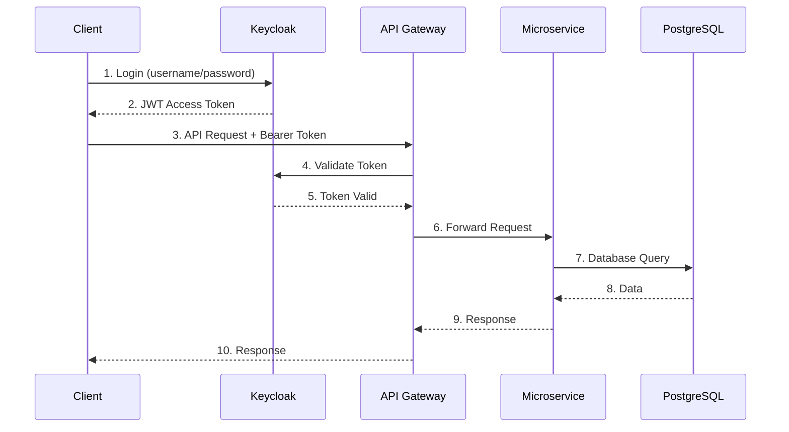
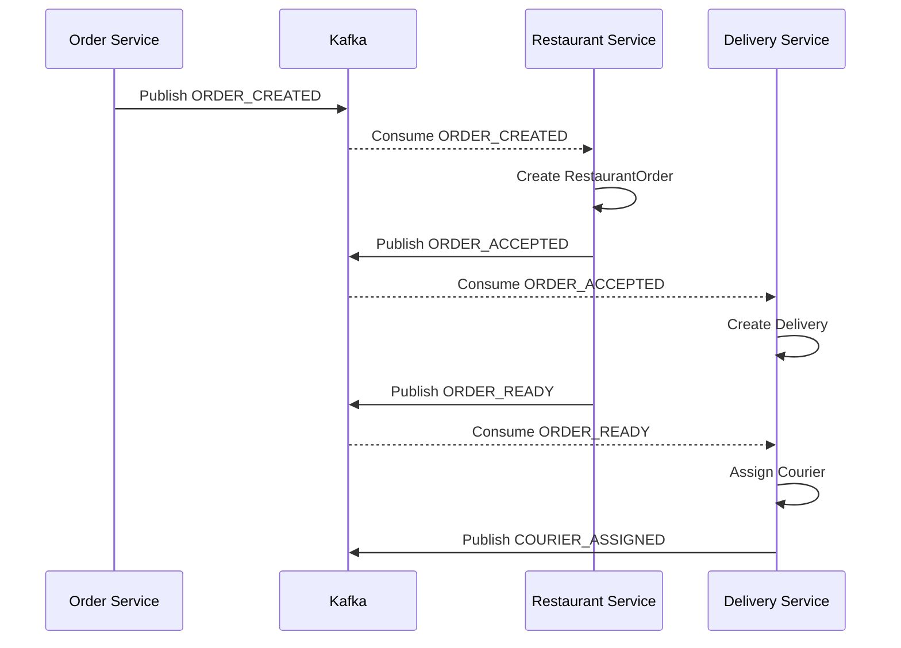
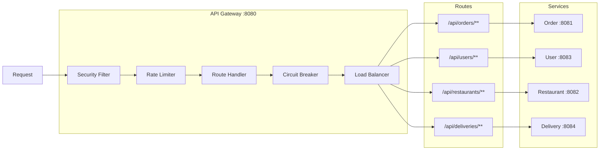
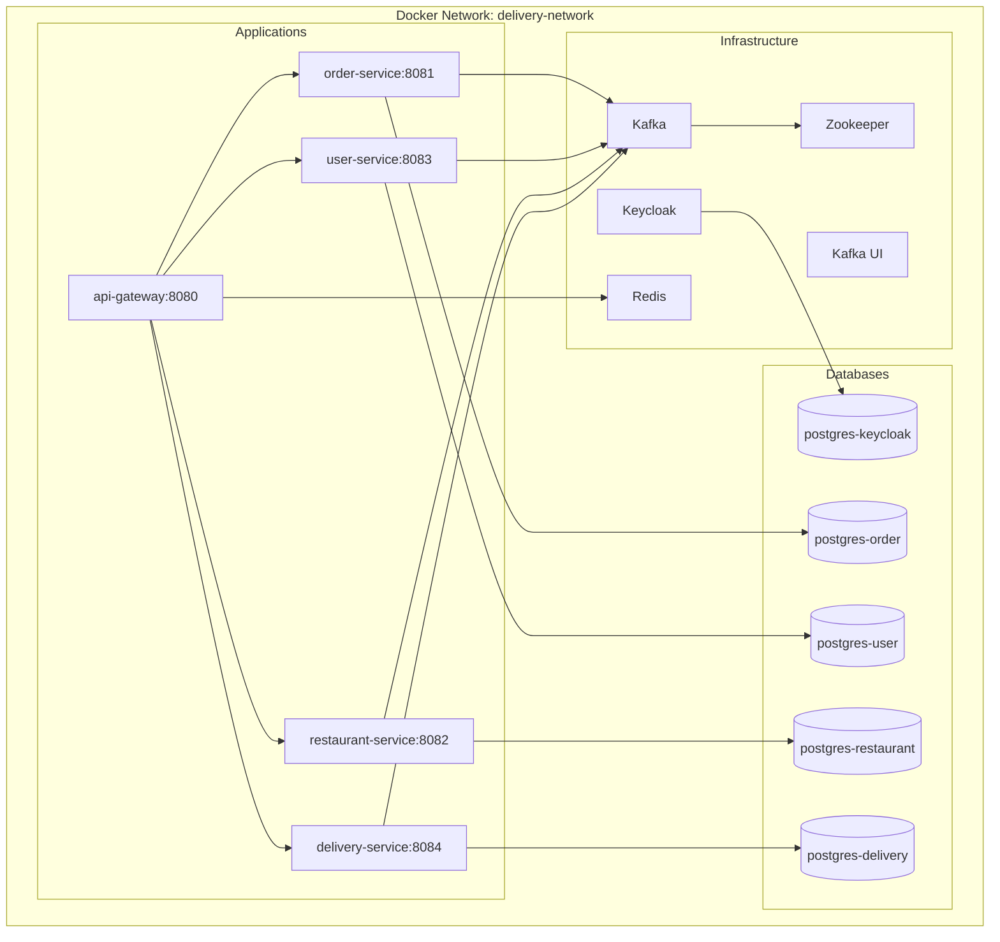

# Architecture Documentation

## High-Level Architecture Diagram

## Service Communication

### Synchronous Communication (REST)

### Asynchronous Communication (Kafka)

## API Gateway Configuration

## Component Diagram

```mermaid
flowchart TB
    subgraph OrderService["Order Service"]
        OC[OrderController]
        PC[PaymentController]
        OSvc[OrderService]
        PSvc[PaymentService]
        ORepo[OrderRepository]
        PRepo[PaymentRepository]
        OKafka[OrderEventProducer]
    end

    subgraph UserService["User Service"]
        UC[UserController]
        AC[AddressController]
        USvc[UserService]
        ASvc[AddressService]
        URepo[UserRepository]
        ARepo[AddressRepository]
        UKafka[UserEventProducer]
    end

    subgraph RestaurantService["Restaurant Service"]
        RC[RestaurantController]
        MC[MenuItemController]
        RSvc[RestaurantService]
        MSvc[MenuItemService]
        RRepo[RestaurantRepository]
        MRepo[MenuItemRepository]
        RKafka[RestaurantEventProducer]
        OListener[OrderEventsListener]
    end

    subgraph DeliveryService["Delivery Service"]
        DC[DeliveryController]
        CC[CourierController]
        DSvc[DeliveryService]
        CSvc[CourierService]
        DRepo[DeliveryRepository]
        CRepo[CourierRepository]
        DKafka[DeliveryEventProducer]
        DListener[OrderEventsListener]
    end

    OC --> OSvc --> ORepo
    PC --> PSvc --> PRepo
    OSvc --> OKafka

    UC --> USvc --> URepo
    AC --> ASvc --> ARepo
    USvc --> UKafka

    RC --> RSvc --> RRepo
    MC --> MSvc --> MRepo
    RSvc --> RKafka
    OListener --> RSvc

    DC --> DSvc --> DRepo
    CC --> CSvc --> CRepo
    DSvc --> DKafka
    DListener --> DSvc
```

## Deployment Diagram

## Technology Stack

| Layer | Technology | Purpose |
|-------|------------|---------|
| Gateway | Spring Cloud Gateway | Routing, Rate Limiting, Circuit Breaking |
| Security | Keycloak + Spring Security OAuth2 | Authentication & Authorization |
| Services | Spring Boot 3.x | Microservices Framework |
| Database | PostgreSQL 15 + Spring Data JPA | Data Persistence |
| Migrations | Flyway | Database Schema Management |
| Messaging | Apache Kafka | Event-Driven Communication |
| Caching | Redis | Rate Limiting, Session Cache |
| Documentation | OpenAPI 3.0 / Swagger | API Documentation |
| Containerization | Docker & Docker Compose | Deployment |
| Resilience | Resilience4j | Circuit Breaker, Retry |
