# Database Entity-Relationship Diagrams

## Overview

The system uses 4 separate PostgreSQL databases, one per microservice, following the database-per-service pattern.

| Service | Database | Port | Tables |
|---------|----------|------|--------|
| Order Service | order_db | 5433 | orders, order_items, payments |
| User Service | user_db | 5435 | users, addresses, user_preferences, favorite_restaurants |
| Restaurant Service | restaurant_db | 5434 | restaurants, menu_items, restaurant_orders, restaurant_order_items |
| Delivery Service | delivery_db | 5436 | couriers, deliveries |

---

## Order Service ERD

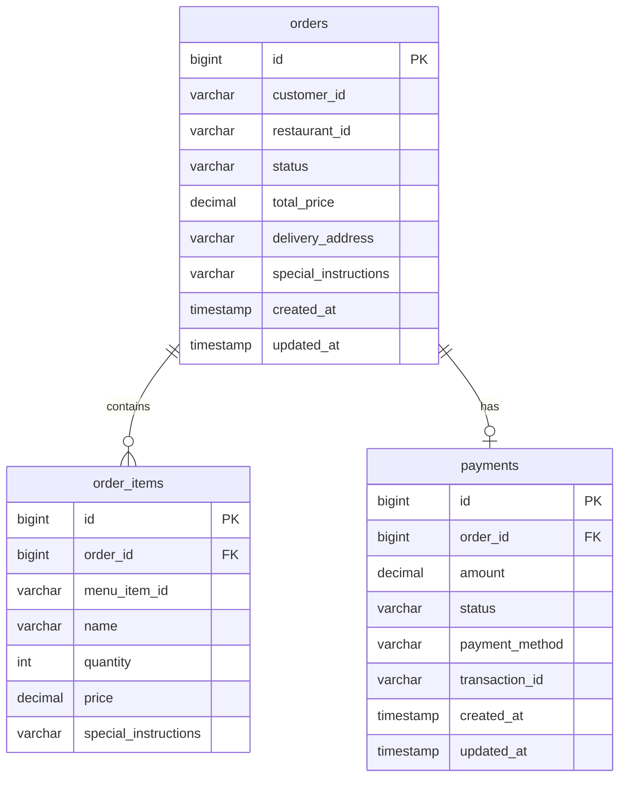

### Order Status Flow

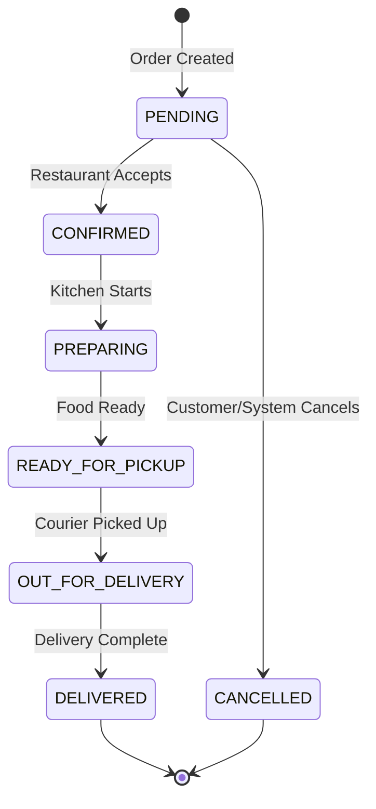

### Payment Status Flow

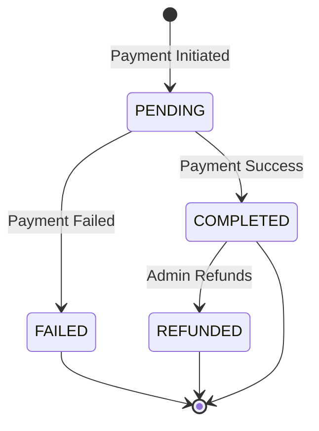

---

## User Service ERD

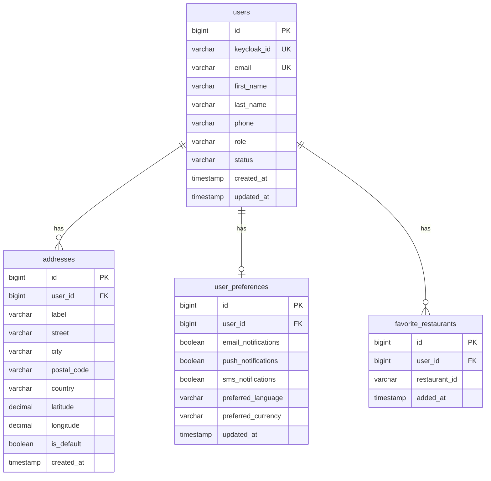

### User Status Flow

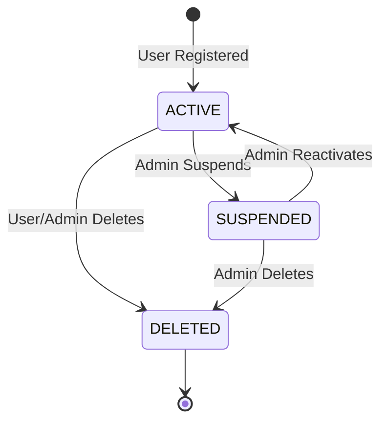

### User Roles

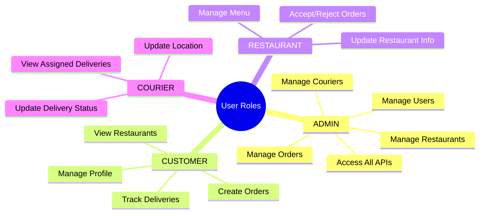

---

## Restaurant Service ERD

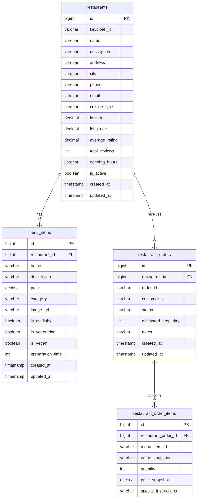

### Restaurant Order Status Flow

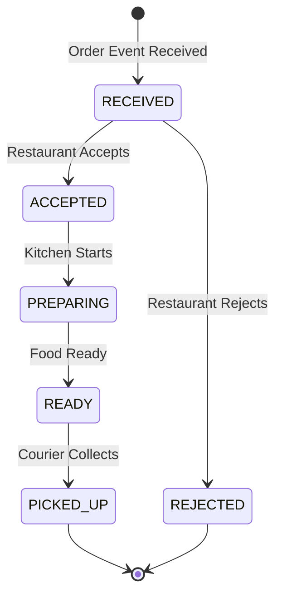

---

## Delivery Service ERD

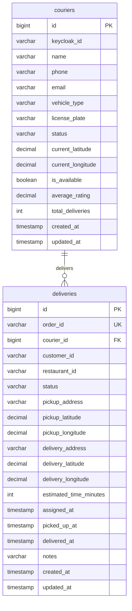

### Delivery Status Flow

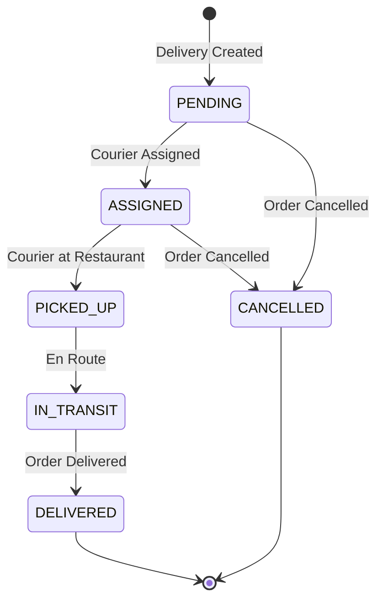

### Courier Status Flow

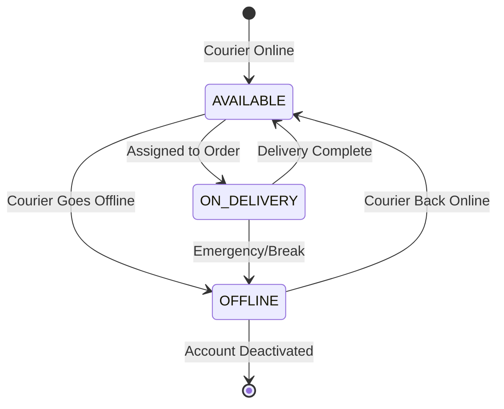

---

## Cross-Service References

Since each service has its own database, references between services use IDs stored as VARCHAR:

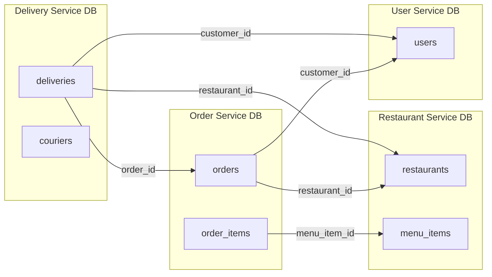

## Flyway Migrations

### Order Service
| Version | Description |
|---------|-------------|
| V1 | Create orders table |
| V2 | Create order_items table |
| V3 | Create payments table |

### User Service
| Version | Description |
|---------|-------------|
| V1 | Create users table |
| V2 | Create addresses table |
| V3 | Create user_preferences table |
| V4 | Create favorite_restaurants table |

### Restaurant Service
| Version | Description |
|---------|-------------|
| V1 | Create restaurants table |
| V2 | Create menu_items table |
| V3 | Create restaurant_orders table |
| V4 | Create restaurant_order_items table |

### Delivery Service
| Version | Description |
|---------|-------------|
| V1 | Create couriers table |
| V2 | Create deliveries table |
