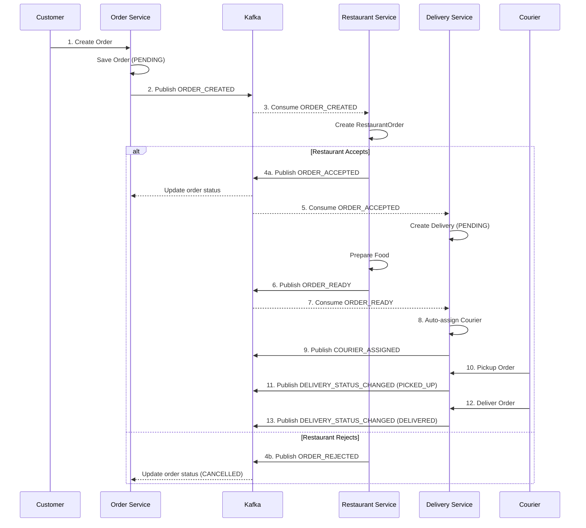
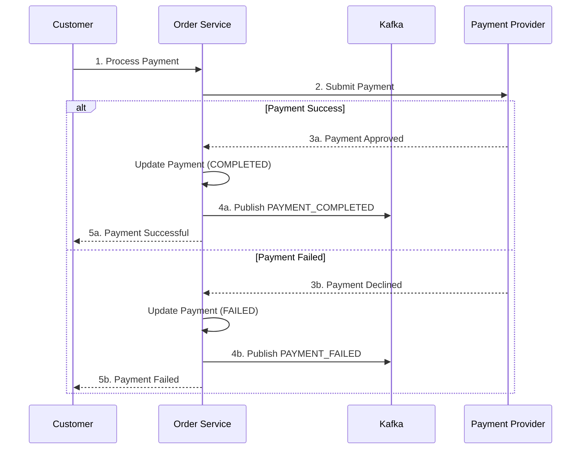
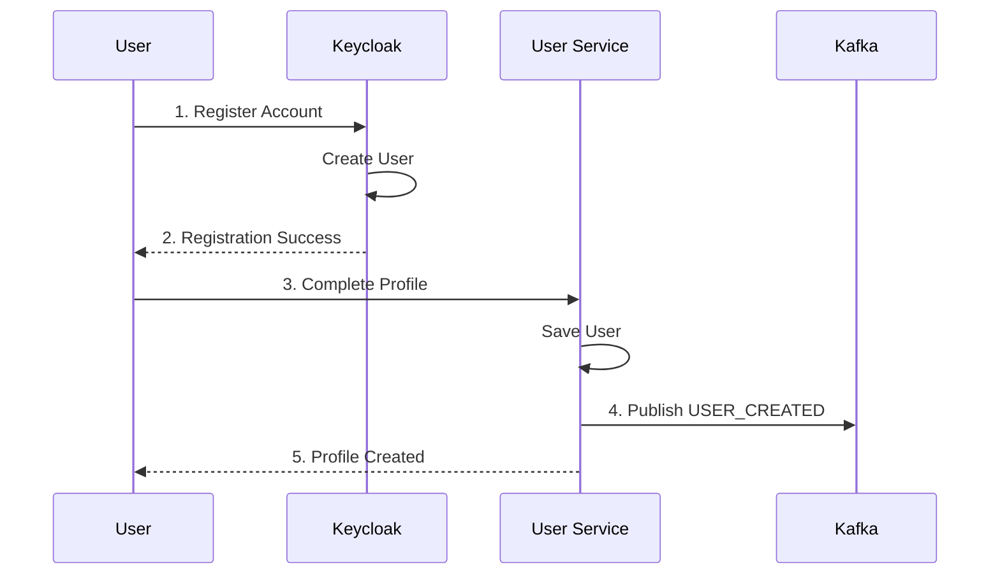

# Kafka Event Flow Documentation

## Overview

The system uses Apache Kafka for asynchronous, event-driven communication between microservices. This enables loose coupling and eventual consistency.

## Kafka Configuration

| Property | Value |
|----------|-------|
| Bootstrap Servers | localhost:9092 (local), kafka:29092 (docker) |
| Zookeeper | localhost:2181 |
| Kafka UI | http://localhost:8090 |

---

## Topics

| Topic | Description | Producers | Consumers |
|-------|-------------|-----------|-----------|
| `order-events` | Order lifecycle events | Order Service | Restaurant Service, Delivery Service |
| `payment-events` | Payment status events | Order Service | - |
| `user-events` | User profile events | User Service | - |
| `restaurant-events` | Restaurant order events | Restaurant Service | Delivery Service |
| `delivery-events` | Delivery status events | Delivery Service | - |

---

## Event Definitions

### Order Events (`order-events`)

```java
public class OrderEvent {
    private String eventId;
    private String eventType;  // ORDER_CREATED, ORDER_CANCELLED
    private Long orderId;
    private String customerId;
    private String restaurantId;
    private BigDecimal totalPrice;
    private String deliveryAddress;
    private List<OrderItemDto> items;
    private LocalDateTime timestamp;
}
```

**Event Types:**
- `ORDER_CREATED` - New order placed by customer
- `ORDER_CANCELLED` - Order cancelled by customer/system

### Payment Events (`payment-events`)

```java
public class PaymentEvent {
    private String eventId;
    private String eventType;  // PAYMENT_COMPLETED, PAYMENT_FAILED
    private Long paymentId;
    private Long orderId;
    private BigDecimal amount;
    private String paymentMethod;
    private String transactionId;
    private LocalDateTime timestamp;
}
```

**Event Types:**
- `PAYMENT_COMPLETED` - Payment successfully processed
- `PAYMENT_FAILED` - Payment processing failed

### User Events (`user-events`)

```java
public class UserEvent {
    private String eventId;
    private String eventType;  // USER_CREATED, USER_UPDATED, USER_STATUS_CHANGED
    private Long userId;
    private String keycloakId;
    private String email;
    private String role;
    private String status;
    private LocalDateTime timestamp;
}
```

**Event Types:**
- `USER_CREATED` - New user registered
- `USER_UPDATED` - User profile updated
- `USER_STATUS_CHANGED` - User status changed (ACTIVE, SUSPENDED, etc.)

### Restaurant Events (`restaurant-events`)

```java
public class RestaurantOrderEvent {
    private String eventId;
    private String eventType;  // ORDER_ACCEPTED, ORDER_REJECTED, ORDER_READY
    private Long restaurantOrderId;
    private String orderId;
    private String restaurantId;
    private Integer estimatedPrepTime;
    private String reason;  // for rejection
    private LocalDateTime timestamp;
}
```

**Event Types:**
- `ORDER_ACCEPTED` - Restaurant accepted the order
- `ORDER_REJECTED` - Restaurant rejected the order
- `ORDER_READY` - Food is ready for pickup

### Delivery Events (`delivery-events`)

```java
public class DeliveryEvent {
    private String eventId;
    private String eventType;  // COURIER_ASSIGNED, DELIVERY_STATUS_CHANGED
    private Long deliveryId;
    private String orderId;
    private Long courierId;
    private String status;
    private Integer estimatedTime;
    private LocalDateTime timestamp;
}
```

**Event Types:**
- `COURIER_ASSIGNED` - Courier assigned to delivery
- `DELIVERY_STATUS_CHANGED` - Delivery status updated

---

## Event Flow Diagrams

### Complete Order Flow



### Payment Flow



### User Registration Flow



---

## Kafka Producers

### Order Service Producer

```java
@Service
@RequiredArgsConstructor
public class OrderEventProducer {
    private final KafkaTemplate<String, Object> kafkaTemplate;

    public void sendOrderCreatedEvent(Order order) {
        OrderEvent event = OrderEvent.builder()
            .eventId(UUID.randomUUID().toString())
            .eventType("ORDER_CREATED")
            .orderId(order.getId())
            .customerId(order.getCustomerId())
            .restaurantId(order.getRestaurantId())
            .totalPrice(order.getTotalPrice())
            .timestamp(LocalDateTime.now())
            .build();

        kafkaTemplate.send("order-events", event);
    }
}
```

### User Service Producer

```java
@Service
@RequiredArgsConstructor
public class UserEventProducer {
    private final KafkaTemplate<String, Object> kafkaTemplate;

    public void sendUserCreatedEvent(User user) {
        UserEvent event = UserEvent.builder()
            .eventId(UUID.randomUUID().toString())
            .eventType("USER_CREATED")
            .userId(user.getId())
            .keycloakId(user.getKeycloakId())
            .email(user.getEmail())
            .role(user.getRole().name())
            .timestamp(LocalDateTime.now())
            .build();

        kafkaTemplate.send("user-events", event);
    }
}
```

---

## Kafka Consumers

### Restaurant Service Consumer

```java
@Service
@RequiredArgsConstructor
public class OrderEventsListener {
    private final RestaurantOrderService restaurantOrderService;

    @KafkaListener(topics = "order-events", groupId = "restaurant-service")
    public void handleOrderEvent(OrderEvent event) {
        if ("ORDER_CREATED".equals(event.getEventType())) {
            restaurantOrderService.createRestaurantOrder(event);
        }
    }
}
```

### Delivery Service Consumer

```java
@Service
@RequiredArgsConstructor
public class OrderEventsListener {
    private final DeliveryService deliveryService;

    @KafkaListener(topics = "order-events", groupId = "delivery-service")
    public void handleOrderEvent(OrderEvent event) {
        if ("ORDER_ACCEPTED".equals(event.getEventType())) {
            deliveryService.createDelivery(event);
        } else if ("ORDER_READY".equals(event.getEventType())) {
            deliveryService.assignCourier(event.getOrderId());
        }
    }
}
```

---

## Consumer Groups

| Consumer Group | Topics | Purpose |
|----------------|--------|---------|
| `restaurant-service` | order-events | Process incoming orders |
| `delivery-service` | order-events, restaurant-events | Manage deliveries |

---

## Error Handling

### Dead Letter Queue (DLQ)

For failed message processing:

```yaml
spring:
  kafka:
    consumer:
      properties:
        spring.deserializer.value.delegate.class: org.springframework.kafka.support.serializer.JsonDeserializer
    listener:
      ack-mode: MANUAL
```

### Retry Configuration

```java
@Configuration
public class KafkaConfig {
    @Bean
    public RetryTemplate retryTemplate() {
        return RetryTemplate.builder()
            .maxAttempts(3)
            .fixedBackoff(1000)
            .build();
    }
}
```

---

## Monitoring

### Kafka UI

Access Kafka UI at http://localhost:8090 to:

1. **View Topics** - See all topics and partitions
2. **Browse Messages** - View message content
3. **Consumer Groups** - Monitor consumer lag
4. **Cluster Health** - Check broker status

### Key Metrics

| Metric | Description |
|--------|-------------|
| Consumer Lag | Messages waiting to be processed |
| Message Rate | Messages per second |
| Partition Distribution | Load across partitions |
| Consumer Group Status | Active/inactive consumers |

---

## Best Practices

1. **Idempotency** - Use eventId to prevent duplicate processing
2. **Ordering** - Use orderId as partition key for ordered processing
3. **Schema Evolution** - Use backward-compatible changes
4. **Error Handling** - Implement DLQ for failed messages
5. **Monitoring** - Track consumer lag and message rates
